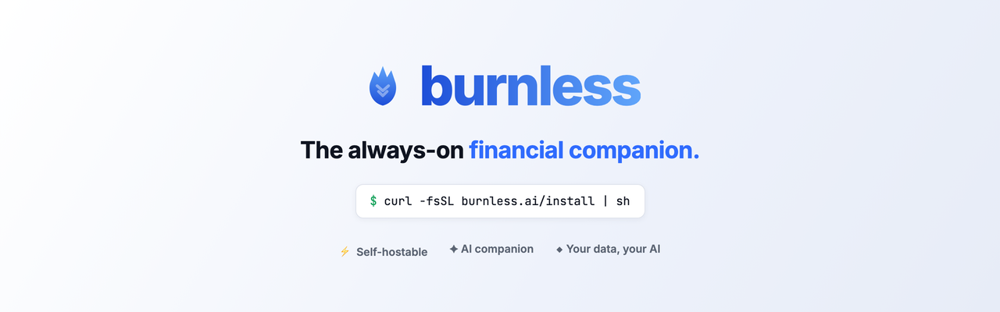
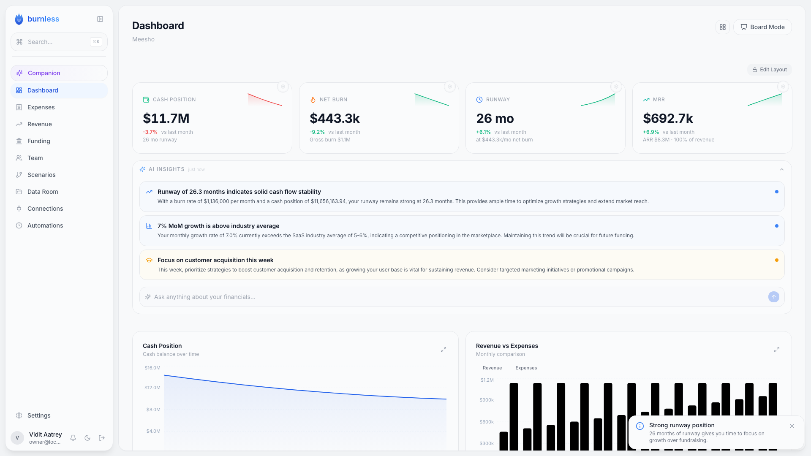
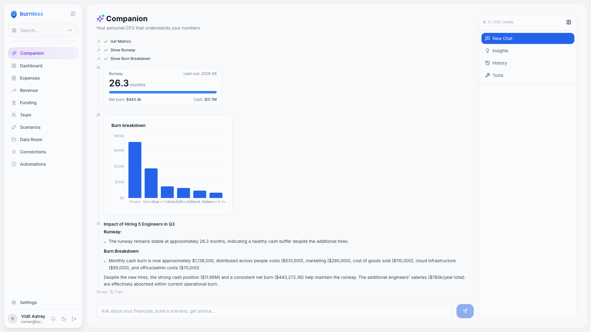
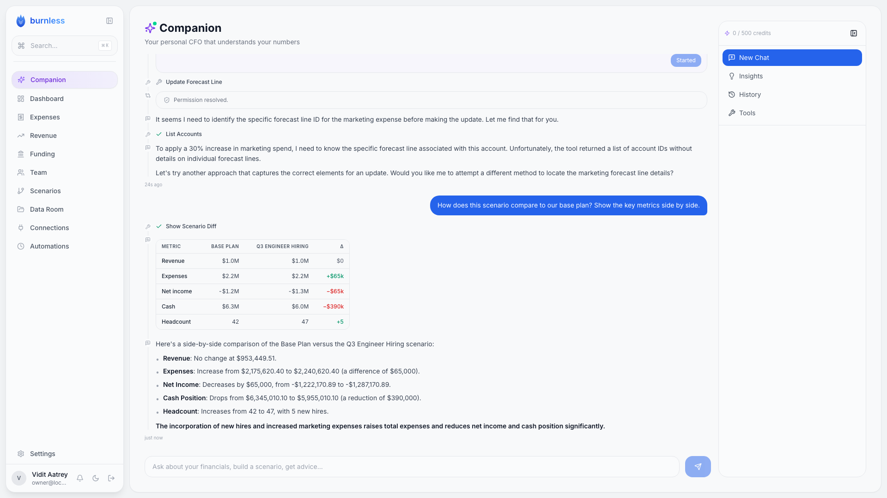
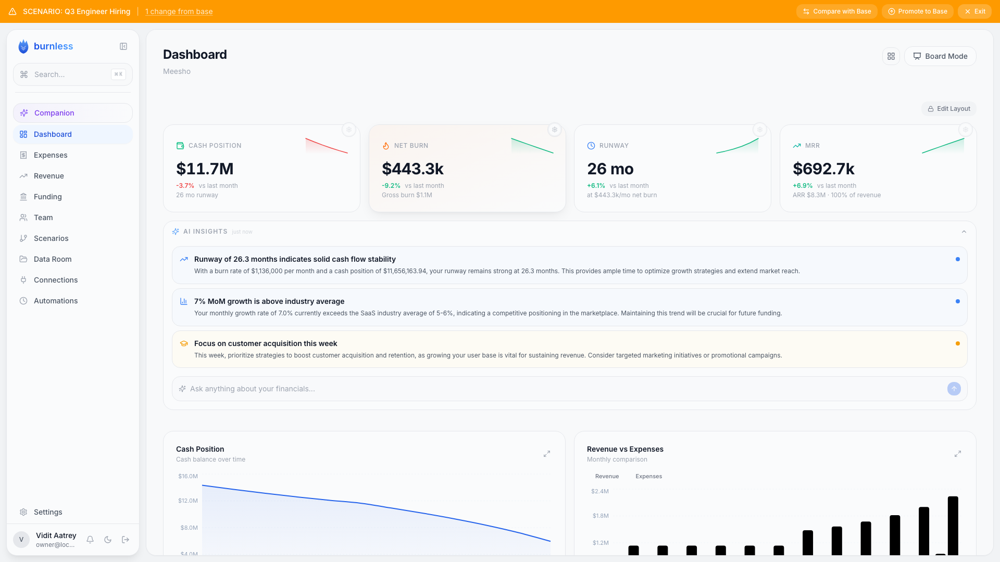
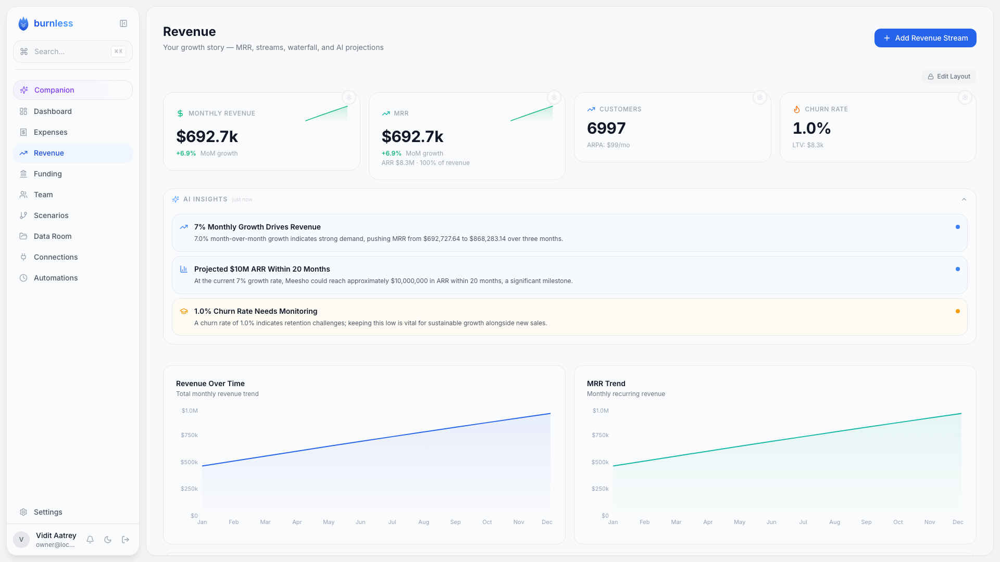
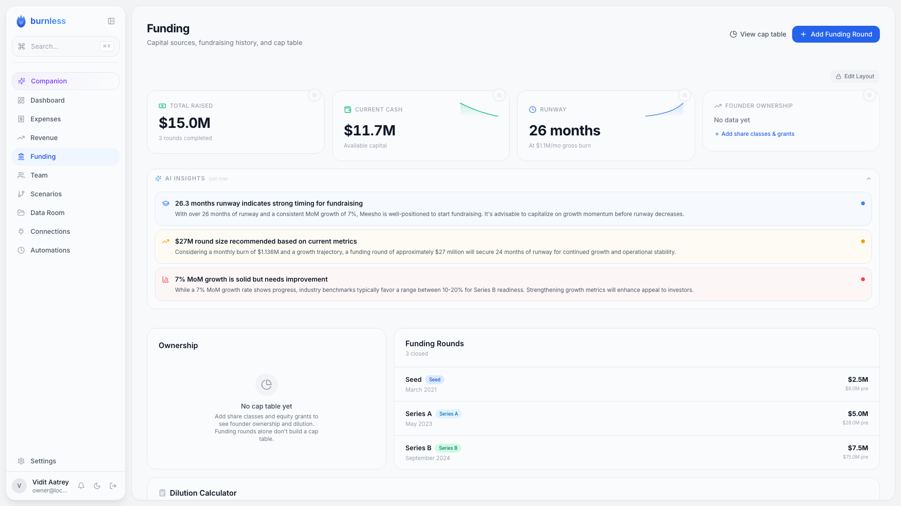
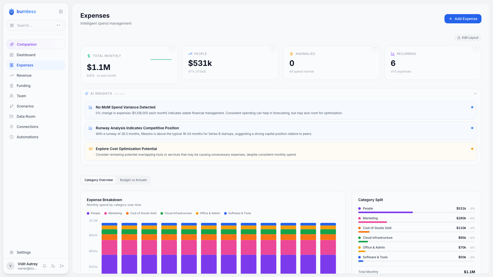
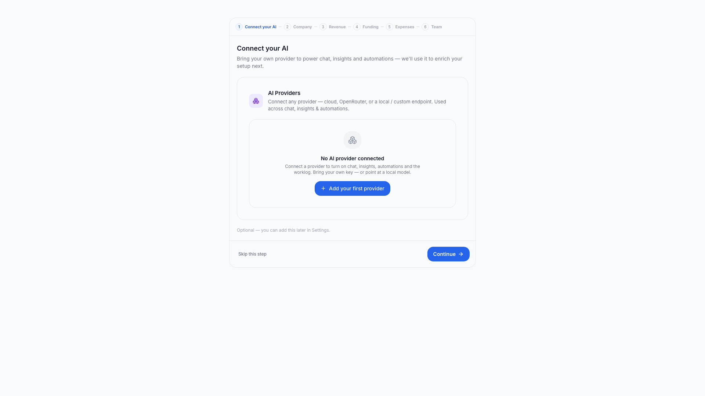

<div align="center">

<a href="https://burnless.ai"></a>

<br>

[](./LICENSE)
[](https://github.com/hoaxnerd/burnless/releases)
[](https://github.com/hoaxnerd/burnless/actions)
[](https://github.com/hoaxnerd/burnless/stargazers)
[](https://github.com/hoaxnerd/burnless/discussions)

<!-- LAUNCH FILM: paste the link below once it's live, then uncomment.
**[▶ Watch the 90-second launch film](VIDEO_URL)**
-->

</div>

---

The scariest part of being a founder isn't running low on cash. It's **finding out a month after you needed to act.**

You're heads-down building a product — not wrangling a spreadsheet for answers, or coaxing a chatbot into doing the math for you. So the numbers drift, and by the time you look, the moment to course-correct has already passed.

**Burnless is the always-on financial companion for founders.** It reads your real financials and watches your burn, your runway, your revenue — all of it, all the time — and surfaces what you need to know *before you have to ask. That morning, not a month later.*

It's open source, AI-native, and self-hosts in **one command** with an embedded database — no Docker, no Postgres to run. Your numbers stay on your machine; you bring your own AI.

```sh
curl -fsSL https://burnless.ai/install | sh
```

## A look inside

<table>
  <tr>
    <td width="25%"><br><sub><b>Always-on dashboard</b> — burn, runway & revenue, watched live, with AI insights surfaced for you.</sub></td>
    <td width="25%"><br><sub><b>The companion</b> — ask in plain English; it answers with real, computed numbers.</sub></td>
    <td width="25%"><br><sub><b>What-if, compared</b> — every change diffed against your base case, line by line.</sub></td>
    <td width="25%"><br><sub><b>Scenario mode</b> — model freely as an overlay, without touching your real data.</sub></td>
  </tr>
  <tr>
    <td width="25%"><br><sub><b>Revenue</b> — MRR, streams, waterfall, and projections.</sub></td>
    <td width="25%"><br><sub><b>Funding</b> — rounds, cap table, and a live dilution calculator.</sub></td>
    <td width="25%"><br><sub><b>Expenses</b> — categorized spend, anomalies, and budget-vs-actuals.</sub></td>
    <td width="25%"><br><sub><b>Smart onboarding</b> — bring your own provider; up and running in a minute.</sub></td>
  </tr>
</table>

## Every decision is a what-if

What if I hire? What if I raise? What if I cut? Ask in plain English and Burnless builds the scenario on your real model — then shows you the impact on runway, burn, and cash before you commit to anything.

Work in **scenario mode** to explore freely: it's a non-destructive overlay on your real data, so nothing you try touches the base case. Compare scenarios side by side, then promote the one you want to baseline.

## And a lot more

- **AI companion** — a chat that reads your live financials and takes actions through tools (build a scenario, adjust headcount, edit a forecast line) instead of just talking about them.
- **Forecasting** — dependency-graph forecast lines with multiple methods (fixed, growth rate, per-unit, percentage-of, custom formula), resolved in topological order.
- **The full model** — revenue (subscription / usage / one-time / services), expenses, funding rounds with cap table, and headcount — all in one place.
- **Reports** — P&L, cash flow, balance sheet, runway, budget-vs-actuals, key metrics, and an AI-assisted board update, exportable for investors.
- **Custom metrics & dashboard** — pin what matters, define your own metrics, lay the dashboard out your way.
- **Automations & MCP** — schedule recurring AI runs, connect external tools over MCP, and expose Burnless itself as an MCP server other agents can drive.
- **Bring any AI** — a provider-agnostic layer works with Anthropic, OpenAI, OpenRouter, or fully local with Ollama.

## Computed, not hallucinated

The math is not the AI's guess. A deterministic, Decimal-precision financial engine and a traceable forecast dependency graph do every calculation; the AI *operates* that engine through tools. So when Burnless tells you your runway, it's a number you can trace — not a number a model made up.

## Quickstart

Install with the shell one-liner:

```sh
curl -fsSL https://burnless.ai/install | sh
```

Or with npm:

```sh
npm install -g burnless
# or run without installing:
npx burnless start
```

Then start your instance:

```sh
burnless start
```

This opens Burnless on `http://127.0.0.1:2876` (port 2876 = **BURN**) with auto-login on the loopback interface, and drops you into the onboarding wizard. One command and you're in.

**Requirements:** Node **≥ 20.9**. Don't have it (or the right version)? Pass `--with-node` and the installer provisions a pinned Node for you:

```sh
curl -fsSL https://burnless.ai/install | sh -s -- --with-node
```

> Prefer to read it first? `curl -fsSL https://burnless.ai/install | less`, then run it.

## Own your numbers

Your financial model is some of the most sensitive data your company has. Burnless is built so it never has to leave your control:

- **Nothing phones home.** Self-hosted, your financials and your AI keys stay on your infrastructure.
- **Your data, your AI, your choice.** Point it at any provider — or run a local model with Ollama — and own the whole stack.
- **Open forever.** The AGPL license keeps improvements open: anyone who ships a modified Burnless shares those changes back. It's honest, not bait-and-switch.
- **It can't be taken away.** Founder finance tools have a habit of getting acquired and shut down. An open-source one you run yourself can't be — the code is yours to keep, run, and reshape.

A managed **cloud** edition — the same codebase with the operational pieces handled for you — is on the way for teams that would rather not run it themselves. The core stays open either way.

## Self-host

The self-host story is the whole point: **a single artifact with an embedded database — no Docker, no Postgres to run.**

```sh
curl -fsSL https://burnless.ai/install | sh   # or: npm install -g burnless
burnless start
```

- **Requirements:** Node ≥ 20.9 (or pass `--with-node` to provision a pinned Node).
- **Your data** lives under `~/.burnless/data`. Back it up by copying that directory — it sits outside the versioned install, so it survives updates and rollbacks.
- **Updates are atomic:** `burnless update` swaps in the new version and runs a health check; if it fails to come up, it automatically rolls back to the prior one. Your data is never touched.
- **Loopback by default:** Burnless binds to `127.0.0.1` — that's what makes auto-login safe, since the loopback interface is the security boundary. Exposing it more widely is an explicit, opt-in step.

| | Self-host | Cloud *(coming)* |
|---|---|---|
| Who runs it | You | Managed for you |
| AI | Bring your own provider / key | Hosted AI included |
| Data | On your machine (`~/.burnless/data`) | Hosted |
| Ops | One command | Zero-ops |
| Cost | Free, forever | Managed plans |

## How it works

Burnless is a pnpm + turbo monorepo. Data flows from the database through the financial engine and AI layer into a Next.js app:

```
                          ┌──────────────────────────┐
   apps/web  ────────────▶│  Next.js app + API +     │
   (dashboard, API,       │  the dashboard UI        │
    middleware)           └────────────┬─────────────┘
                                        │
        ┌───────────────────────────────┼───────────────────────────────┐
        ▼                                ▼                                ▼
 packages/engine               packages/ai                       packages/db
 pure-TS financial calc        provider-agnostic LLM layer        Drizzle ORM
 (Decimal precision)           (Anthropic/OpenAI/                 PGlite local /
                                OpenRouter/Ollama)                 Postgres cloud

   packages/cli  →  the `burnless` CLI (start / update / mcp serve / …)
   packages/mcp  →  Model Context Protocol support (consume + expose)
   packages/types, packages/ui  →  shared TS types + React components
```

- **`apps/web`** — the Next.js app: dashboard, API routes, and middleware.
- **`packages/engine`** — pure-TypeScript financial calculations with Decimal.js precision (no I/O, no DB).
- **`packages/ai`** — the provider-agnostic LLM layer and chat/tool loop.
- **`packages/db`** — Drizzle ORM schema and queries; PGlite when self-hosted, Postgres for cloud and scale.
- **`packages/cli`** — the `burnless` CLI that installs, starts, updates, and manages your instance.
- **`packages/mcp`** — Model Context Protocol support: connect external MCP tools and expose Burnless as an MCP server.
- **`packages/types` / `packages/ui`** — shared TypeScript types and React components.

## Documentation

Start with [CONTRIBUTING.md](./CONTRIBUTING.md) for development setup and conventions. More documentation is on the way as the project matures.

## Community & support

- **Questions, ideas, show-and-tell:** [GitHub Discussions](https://github.com/hoaxnerd/burnless/discussions)
- **Bugs & feature requests:** [GitHub Issues](https://github.com/hoaxnerd/burnless/issues)
<!-- FOLLOW: add your X/Twitter handle here once the launch is posted, e.g.
- **Building in public:** follow along [@handle](https://x.com/handle)
-->

## Contributing

Contributions are welcome. Read [CONTRIBUTING.md](./CONTRIBUTING.md) to get a local instance running and learn the conventions. On your first pull request, the CLA Assistant bot will ask you to sign a one-time Contributor License Agreement — a low-friction, automated step that takes a moment.

## Security

Found a vulnerability? Please report it privately — see [SECURITY.md](./SECURITY.md).

## License

Burnless is split so it's open where it matters and embeddable where it helps you:

- The server and the `@burnless/*` packages are **AGPL-3.0** ([LICENSE](./LICENSE)) — improvements stay open.
- The **`burnless` CLI is Apache-2.0** ([packages/cli/LICENSE](./packages/cli/LICENSE)) — so you can embed and script it freely.

A Contributor License Agreement exists for one reason: it lets us offer a commercial / hosted edition that funds continued development. It does not take away your rights to your own contribution — you keep them.

---

<div align="center">

**Happy building.**

<sub>Burnless is an independent open-source project and is not affiliated with or endorsed by any third-party provider or trademark referenced above.</sub>

</div>
